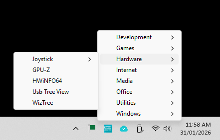

# StartLE

*A low-effort start menu for Microsoft Windows.*



## Description

*StartLE* is an adjunct to the Windows start menu. It adds an icon to the taskbar's system tray (notification area). Left-clicking or touching *StartLE*'s icon displays a simple menu of apps and/or documents. Selecting an item from the menu launches it. You can customise the menu to include any items that you want.

*StartLE* doesn't replace the Windows start menu. It can be useful to launch commonly-used apps and documents without having to see the Windows desktop or search in Windows' start menu.

## Advantages

* *StartLE* is simple and unobtrusive.
* You have complete control over the structure and contents of the menu; it won't be changed by Windows or apps.
* You are not limited to only two levels of hierarchy; *i.e.*, you can use as many levels of sub-menu as you like.

## Disadvantages

* Customising *StartLE*'s menu requires editing an [XML](https://en.wikipedia.org/wiki/XML) file.
* If you install or uninstall apps, the menu won't automatically add or remove relevant items.
* Icons and accelerator keys aren't currently supported.

## Download

* Microsoft Store (coming soon – maybe)
* [github releases](https://github.com/gondwanasoft/StartLE/releases)

## Installation

If you obtain an installation package from here, unzip it and run `Install.ps1`. This will guide you through installation of the security certificate, which is used to verify that the app comes from its original creator (Gondwana Software). If you don't trust this process, install the Microsoft Store version instead.

> [!NOTE]
> You may need to adjust Windows Settings (`System > Advanced > Terminal > PowerShell`) to allow `Install.ps1` to run.

## Editing the Menu

*StartLE*'s menu is built from the file `Menu.xml`. A default `Menu.xml` is installed when you install *StartLE*. That file is not intended to be useful, but to demonstrate the structure of the file. Once you get the hang of it, you'll probably want to delete the original items from the file.

To edit `Menu.xml`, right-click or long-press *StartLE*'s icon in the system tray. This will give you options for opening `Menu.xml` using Windows Notepad or whatever app you've set as the default for opening XML files.

The easiest way to understand the structure of `Menu.xml` is to open it and inspect it. General information about XML terminology and structure can be found [here](https://en.wikipedia.org/wiki/XML).

> [!WARNING]
> While you could put everything in your Windows Start menu in `Menu.xml`, you probably shouldn't. A very large `Menu.xml` will make *StartLE* slower to start and take more memory (although neither effect is likely to be noticeable). *StartLE* doesn't replace Windows' Start menu; think of it as a quick-start launcher for frequently-used apps.

### Example

```
<?xml version="1.0" encoding="utf-8"?>
<startle version="1.0">
  <menu>
    <menu text="Games" >
      <item text="Solitare" filename="ms-solitaire-collection:" />
    </menu>
    <menu text="Internet" >
      <item text="Bing" filename="https://bing.com"/>
    </menu>
    <menu text="Media" >
      <item text="Photos" filename="ms-photos:" />
      <item text="Wallpaper" filename="C:\Windows\Web\Wallpaper\Windows\img0.jpg" />
      <item text="Wallpaper (print)" filename="C:\Windows\Web\Wallpaper\Windows\img0.jpg" verb="print"/>
    </menu>
    <menu text="Utilities" >
      <item text="Calculator" filename="calc.exe"/>
      <item text="File Explorer" filename="c:\windows\explorer.exe"/>
    </menu>
    <menu text="Windows" >
      <item text="Regedit" filename="regedit.exe" verb="runas"/>
      <item text="Startup" filename="c:\windows\explorer.exe" args="shell:Startup" style="maximized"/>
    </menu>
  </menu>
</startle>
```

### \<startle>

After the `<?xml ... ?>` declaration, `Menu.xml` must contain a `<startle ... />` element.

To get *StartLE* to load automatically when Windows starts, include the optional `startup=""` attribute in the `<startle ... />` element.

The `<startle ... />` element must contain a single `<menu ... />` element. This is the top-level menu that will be displayed when you open *StartLE*.

### \<menu>

Other than the top-level `<menu>` (*i.e.*, the child of the `<startle>` element), all `<menu>` elements must have a `text` attribute. This is the menu label that will be displayed when you use *StartLE*.

A `<menu>` element can contain one or more `<menu>` and `<item>` elements as children (sub-elements).

### \<item>

An `<item>` element specifies the app or file to be opened when selected from the StartLE menu. An `<item>` can contain the following attributes:

* `text` (required): the item label that will be displayed when you use *StartLE*.
* `filename` (required): the path and name of the file to be opened.
* `args` (optional): arguments that need to be passed to the app; *e.g.*, the name of a file to edit in the app.

> [!NOTE]
> `args` or other attributes might occasionally require you to include quotation marks in the attribute value. This can be tricky because XML uses quotation marks around attribute values. XML allows either single or double quotation marks around values, so if you need to embed a double quotation mark, surround the value with single quotation marks. If that isn't enough, use [escaping](https://en.wikipedia.org/wiki/XML#Escaping).

* `folder` (optional): the folder in which the app will be started.
* `style` (optional): the initial size of the app window: `maximized`, `normal`, `minimized` or `hidden`.

> [!NOTE]
> Setting `style` won't always work because some apps ignore it and do their own thing.

* `verb` (optional): what to do when opening the item. Available options depend on the app; common verbs are `open`, `edit` and `print`. `runas` will try to start the app with administrator privileges.

> [!NOTE]
> Setting `verb="runas"` won't always suffice (*e.g.*, with HWInfo64.exe). Marking the .exe 'Run this program as an administrator' using Windows Explorer may help.

### Saving Changes

After saving your changes to `Menu.xml`, you'll need to get *StartLE* to rebuild its menu. To do so, right-click or long-press *StartLE*'s system tray icon and select `Reload`. If *StartLE* encounters any errors when reloading the file, they will be reported using notifications.

> [!WARNING]
> If you uninstall *StartLE*, your `Menu.xml` file will be deleted. If you want to keep it, save a copy somewhere safe (*e.g.*, in your `Documents` folder).

## Hotkey Access

Instead of clicking or touching, you can use `Winkey+/` to open *StartLE*'s menu. The menu will displayed beside the mouse cursor.

> [!NOTE]
> If you use a non-UK/US keyboard language and Windows' IME (Input Method Editor), pressing `Winkey+/` will probably open the IME as well as *StartLE*.

> [!NOTE]
> If you close the *StartLE* menu without selecting an item, focus will not be returned to the app you were using previously.

## Startup

To get *StartLE* to load automatically when Windows starts, add the `startup=""` attribute to the `<startle ... />` element in `Menu.xml`. Alternatively, use Windows' Settings to enable or disable *StartLE* as a startup app.

Regardless of how you start *StartLE*, its menu will not be available instantly. `Menu.xml` is processed as a background task (to minimise impact on Windows' startup time). If *StartLE*'s menu isn't fully populated when you try to use it straight away, wait a second or two. If it doesn't appear subsequently, check Windows' notification history for error messages.

## Support

Please ask questions [here](https://gondwanasoftware.au/startle/contact.html).

Please report issues [here](https://github.com/gondwanasoft/StartLE/issues).